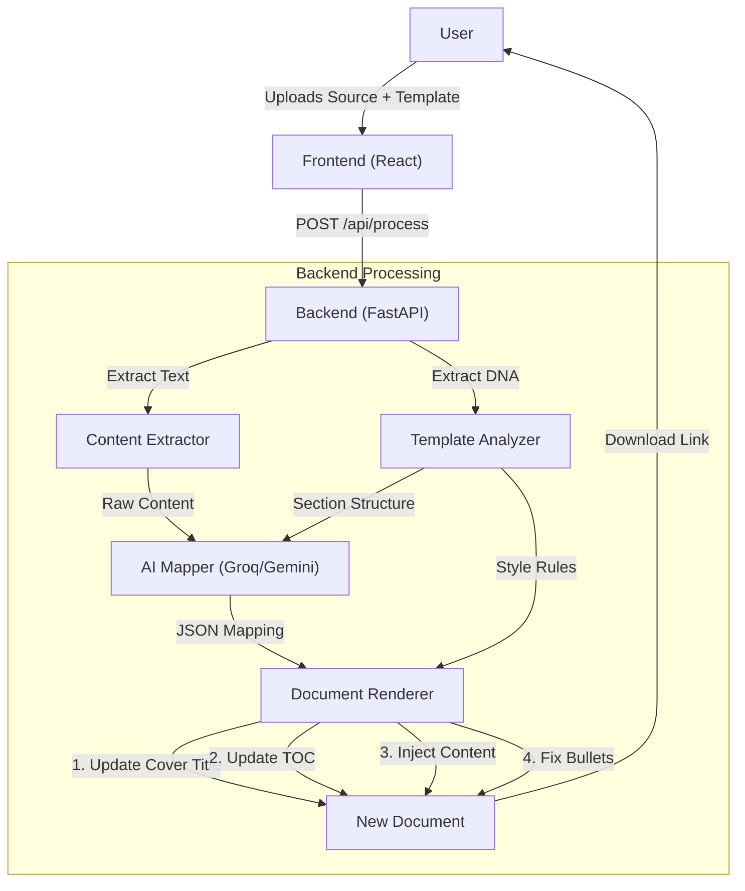

# Optira AI - Intelligent Document Style Transfer

Optira AI is a powerful document transformation engine that uses Artificial Intelligence to separate content from presentation. It allows users to take raw, unformatted text and automatically inject it into a stylized corporate template (`.docx`), preserving sophisticated formatting rules, updating the Table of Contents, and ensuring brand consistency.


## 🚀 Key Features

- **AI-Powered Content Mapping**: Intelligently breaks down raw source text into logical sections (Introduction, Problem, Solution, etc.) using Large Language Models (LLM).
- **Template DNA Extraction**: Analyzes a reference `.docx` template to understand its structure, fonts, colors, and styling rules.
- **Smart Style Transfer**: Reconstructs the document content using the template's exact styles ("Heading 1", "Normal", "List Bullet").
- **Automatic TOC Update**: Detects and updates Table of Contents entries, preserving dot leaders and page formatting.
- **Cover Page Intelligence**: Identifies the cover page title and updates it to match the new content.
- **Bullet Point Deduplication**: Advanced logic to prevent duplicate bullet points and ensure clean lists.
- **Multi-Model Support**: Switch between **Groq** (Llama 3) and **Google Gemini 2.0** for AI processing.

## 🛠 Tech Stack

### Frontend
- **Framework**: React 18 + Vite
- **UI Library**: Shadcn UI + Radix Primitives
- **Styling**: TailwindCSS
- **State Management**: React Query
- **Icons**: Lucide React

### Backend
- **Framework**: FastAPI (Python 3.10+)
- **Document Processing**: `python-docx`
- **AI Integration**: 
  - `groq` (Llama 3.3 70B)
  - `google-generativeai` (Gemini 2.0 Flash)
- **Validation**: Pydantic

---

## 🏗 Architecture & Flow



### How It Works

1.  **Ingestion**: User uploads a **Source Document** (raw info) and a **Template Document** (styled).
2.  **Analysis**:
    *   **Template DNA**: The system scans the template to find "Safe Zones" (logos, headers), Heading styles, and Body styles.
    *   **Content Extraction**: Text is stripped from the source document.
3.  **AI Mapping**: The LLM parses the raw text and maps it to the template's section structure (e.g., "Map this paragraph to the 'Introduction' section").
4.  **Reconstruction**:
    *   The **Renderer** cleans the template (removing old body text).
    *   It updates the **Cover Page Title** and **Table of Contents**.
    *   It injects new content using the correct template styles.
    *   It applies **Deduplication Logic** to ensure clean bullet points.

---

## ⚡ Setup & Installation

### Prerequisites
- Node.js (v18+)
- Python (v3.10+)
- API Key for **Groq** OR **Google Gemini**

### 1. Backend Setup

```bash
# Navigate to backend
cd backend

# Create virtual environment
python -m venv venv
source venv/bin/activate  # On Windows: venv\Scripts\activate

# Install dependencies
pip install -r requirements.txt

# Configure Environment
cp .env.example .env
```

**Update `.env` with your keys:**
```ini
# Choose Provider: 'groq' or 'gemini'
AI_PROVIDER=gemini

# Add your key
GEMINI_API_KEY=your_gemini_key_here
GROQ_API_KEY=your_groq_key_here
```

**Run Server:**
```bash
uvicorn app.main:app --reload
# Server running at http://localhost:8000
```

### 2. Frontend Setup

```bash
# Navigate to frontend
cd frontend

# Install dependencies
npm install

# Run Development Server
npm run dev
# Frontend running at http://localhost:5173
```

---

## 📝 Usage Example

1.  **Prepare Template**: Ensure your `.docx` template has clear styles (e.g., use Word's "Heading 1" for titles).
2.  **Prepare Content**: Have a text file or doc with the content you want to format.
3.  **Upload**:
    *   Drag & Drop Template
    *   Drag & Drop Source Content
4.  **Process**: Click "Generate Document".
5.  **Result**: Download the polished file. The system will have:
    *   Kept your company logo/header.
    *   Updated the Title on the first page.
    *   Updated the Table of Contents items.
    *   Formatted your text into clean Headings and Bullets.

---

## 🧪 Testing Coverage

The project includes robust testing logic for:
- **Bullet Point Duplication**: Ensures lists don't appear as both text and bullets.
- **TOC Formatting**: Preserves dot leaders (`.......`) and page formatting.
- **Fallback Mechanisms**: If a style (e.g., "List Bullet") is missing, it falls back to manual formatting to prevent crashes.

---

## 📄 License

MIT License. Free to use and modify.
